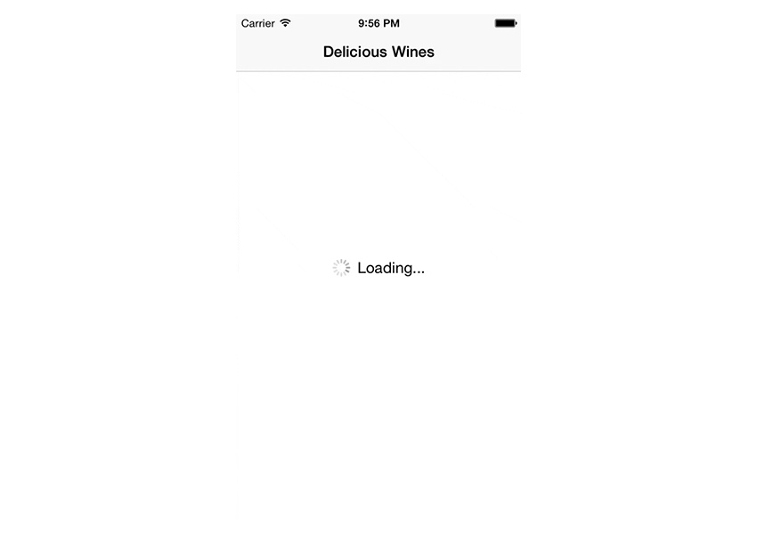

# StatefulUI


A protocol to enable `UIViewController`s or `UIView`s to present placeholder views based on content, loading, error or empty states.



## Overview

In a networked application a view controller or custom view typically has the following states that need to be communicated to the user:

* **Loading**: The content is currently loaded over the network.
* **Content**: The content is available and presented to the user.
* **Empty**: There is currently no content available to display.
* **Error**: An error occurred whilst downloading content.

As trivial as this flow may sound, there are a lot of cases that result in a rather large decision tree.


`StatefulViewController` is a concrete implementation of this particular decision tree. (If you want to create your own modified version, you might be interested in the [state machine](#viewstatemachine) that is used to show and hide views.)

## Usage

> This guide describes the use of the `StatefulViewController` protocol on `UIViewController`. However, you can also adopt the `StatefulViewController` protocol on any `UIViewController` subclass, such as `UITableViewController` or `UICollectionViewController`, as well as your custom `UIView` subclasses.

First, make sure your view controller adopts to the `StatefulViewController` protocol.

```swift
class MyViewController: UIViewController, StatefulViewController {
    // ...
}
```

Then, configure the `loadingView`, `emptyView` and `errorView` properties (provided by the `StatefulViewController` protocol) in `viewDidLoad`. You can use the provided default views, which can be configured in a miriad of ways (note that some accept a `delegate` for callbacks on button presses).

```swift
override func initializeEmptyStateViews() {
    emptyView = StateEmptyView.load(subtitle: "No items found", delegate: self)
    errorView = StateErrorView.load(delegate: self)
    loadingView = StateLoadingView.load()
}
```

After that, simply tell the view controller whenever content is loading and `StatefulViewController` will take care of showing and hiding the correct loading, error and empty view for you.

```swift
override func viewWillAppear(animated: Bool) {
    super.viewWillAppear(animated)

    loadDeliciousWines()
}

func loadDeliciousWines() {
    startLoading()

    let url = NSURL(string: "http://example.com/api")
    let session = NSURLSession.sharedSession()
    session.dataTaskWithURL(url) { [weak self] (let data, let response, let error) in
        self?.endLoading(error: error)
    }.resume()
}
```

### Life cycle

StatefulViewController calls the `hasContent` method to check if there is any content to display. If you do not override this method in your own class, `StatefulViewController` will always assume that there is content to display. There are default implementations for `UITableView`, `UICollectionView` and their controller variants.

```swift
func hasContent() -> Bool {
    return datasourceArray.count > 0
}
```

Optionally, you might also be interested to respond to an error even if content is already shown. `StatefulViewController` will not show its `errorView` in this case, because there is already content that can be shown.

To e.g. show a custom alert or other unobtrusive error message, use `handleErrorWhenContentAvailable:` to manually present the error to the user.

```swift
func handleErrorWhenContentAvailable(error: ErrorType) {
    let alert = UIAlertController(title: "Ooops", message: "Something went wrong.", preferredStyle: .alert)
    alert.addAction(UIAlertAction(title: "OK", style: .default, handler: nil))
    presentViewController(alert, animated: true)
}
```

Similarly, you may want to show activity to the user even if there's content shown. Implement the `subtleActivityIndicatorView` property and provide an activity indicator:

```swift
var subtleActivityIndicatorView: ActivityIndicatingView? {
    return footerActivityIndicator
}
```

### Custom Placeholder View insets

Per default, StatefulViewController presents all configured placeholder views fullscreen (i.e. with 0 insets from top, bottom, left & right from the superview). In case a placeholder view should have custom insets the configured placeholderview may conform to the `StatefulPlaceholderView` protocol and override the `placeholderViewInsets` method to return custom edge insets.

```swift
class MyPlaceholderView: UIView, StatefulPlaceholderView {
    func placeholderViewInsets() -> UIEdgeInsets {
        return UIEdgeInsets(top: 20, left: 20, bottom: 20, right: 20)
    }
}
```

<a name="viewstatemachine"></a>

### View State Machine

> Note: The following section is only intended for those, who want to create a stateful controller that differs from the flow described above.

You can also use the underlying view state machine to create a similar implementation for your custom flow of showing/hiding views.

```swift
let stateMachine = ViewStateMachine(view: view)

// Add states
stateMachine["loading"] = loadingView
stateMachine["other"] = otherView

// Transition to state
stateMachine.transitionToState(.View("loading"), animated: true) {
    println("finished switching to loading view")
}

// Hide all views
stateMachine.transitionToState(.None, animated: true) {
    println("all views hidden now")
}
```

## Installation

#### CocoaPods

Add the following line to your Podfile.

```ruby
pod "StatefulUI", "~> 1.0"
```

Then run `pod install` with CocoaPods 1.4 or newer.

## Contributing

* Create something awesome, make the code better, add some functionality,
  whatever (this is the hardest part).
* [Fork it](http://help.github.com/forking/)
* Create new branch to make your changes
* Commit all your changes to your branch
* Submit a [pull request](http://help.github.com/pull-requests/)

## Credits

StatefulUI is brought to you by [David Jennes](https://twitter.com/davidjennes). It is a fork of [StatefulViewController](https://github.com/aschuch/StatefulViewController), originally written by [@schuchalexander](http://twitter.com/schuchalexander).

## License

StatefulUI is available under the MIT license. See the LICENSE file for more info.
